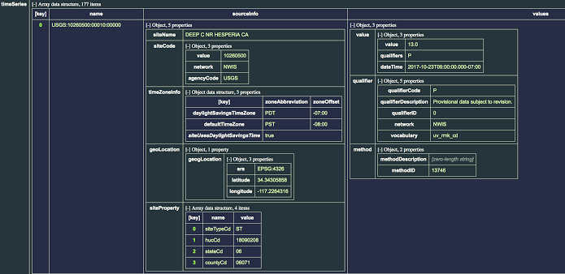

# Week 4

## Achievements
1. Examined the data from USGS water quality website. 
 
Using web-Api, the JSON formatted raw data could be accessed (Scaled down the data for "CA" information only)

2. Extracted the real-time data information from the website and get the structure of data.

3. Applied data cleaning on the JSON format raw data to keep only measurements on water quality.Cleaned and reformatted the data

4. Setup and configured MongoDB to store the data.
5. Pass the data into MongoDB and applied some basic queries.
