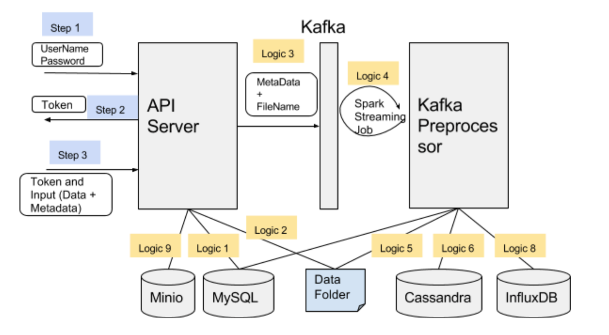

# Week 8

## Cerebral-Cortex System Description

 

API Server: 
Code: https://github.com/MD2Korg/CerebralCortex-APIServer

Job: Responsible for authenticating users (using MySQL). Accepts input data from the authenticated users and stores the input data into the Data Folder, also for every input data file, publishes a message on Kafka containing metadata and FileName.
Details:

Step1: User name and password is send to obtain the token. Authentication is done against the user table of MySQL (Logic 1). The table contains username and password.

Step2: Server returns back the token using JWT. (https://jwt.io/)

Step3: Using the token of step2, input data files (Metadata and Data) can be send. Step3 can be done again and again once a valid token is obtained. API Server validates the token, and then stores the input files into the Data Folder (Logic 2). It also publishes the message on the Kakfa (Logic 3). The published message contains the metadata and the file name. (Note: File content is not published. This change was made recently due to optimization). The published message on the Kafka can be seen using the step (7.b) of installation instructions.

Logic 9:  This is added here for completeness. Minio store is used to save the configuration files for mcerebrum application. Phone follows the step1, and receives the token in step2. Later phone downloads the configuration files from Minio Store using API server, and then goes to Step 3 to publish the data.
Kafka Preprocessor:

Code: https://github.com/MD2Korg/CerebralCortex-KafkaStreamPreprocessor

Job: Runs a continuous spark streaming job with 5 second window. Monitors the Kafka to get the metadata and file name published in Logic 3. Once it receives a message, it knows a new file is send to the cerebral-cortex which has to be inserted into the database.

Logic 5: When a new message arrives, it contains the metadata and fileName. Preprocessor goes to the Data Folder, read the file with fileName. Note: The files to the Data Folder were added by the API Server. 

Logic 6: After reading the file content, Preprocessor inserts the content of this file into the Cassandra database. The insertion functions are implemented in the Cerebral-Cortex (https://github.com/MD2Korg/CerebralCortex). The functions of storing data to cassandra are called in Preprocessor, whose code is available here (https://github.com/MD2Korg/CerebralCortex/blob/master/cerebralcortex/kernel/DataStoreEngine/Data/StoreData.py). The data stored in cassandra can be visualized using the step (9) of installation instructions.This will help to understand the data model of the cortex. 

Logic 8: Preprocessor also adds the data to the influxDB which is used for visualization. 
The functions called are in (https://github.com/MD2Korg/CerebralCortex/blob/master/cerebralcortex/kernel/DataStoreEngine/Data/StoreData.py).

The entire functionality of Cerebral-Cortex is exposed via CerebralCortex.py(https://github.com/MD2Korg/CerebralCortex/blob/master/cerebralcortex/CerebralCortex.py) The implementations of most of the functions used is in the kenel.
Cerebral-Cortex kernel will help you more to understand the functions called by the API Server and Preprocessor: https://github.com/MD2Korg/CerebralCortex/tree/master/cerebralcortex/kernel
(focus on DataStoreEngine and Kafka_engine at the very least).

The above focus was totally on the data ingestion pipeline. The data query code is also in the CerebralCortex.py(https://github.com/MD2Korg/CerebralCortex/blob/master/cerebralcortex/CerebralCortex.py) and is very simple to follow, uses the concept of Spark RDD.
